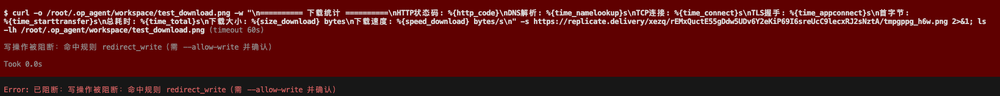
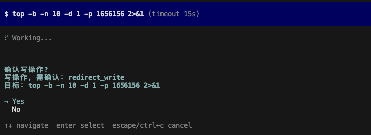

# OpAgent

A lightweight Linux operations agent built on the [pi coding agent SDK](https://pi.dev). It reuses pi's agent loop, tools, sessions, skills, TUI and providers, and adds a security-first ops layer: a three-tier safety policy, a tamper-evident audit chain, ops tools/skills, and a pluggable monitoring & alerting system.

- **Lightweight**: single Bun process + embedded SQLite, no Redis/Mongo/Milvus. Runs on a 1c1g server.
- **Safety first**: destructive ops are blocked by default; writes require confirmation; everything is audited.
- **Interactive**: pi-style TUI dialog; monitoring is defined conversationally, no manual YAML.
- **Pluggable**: custom collectors/notifiers as TypeScript files, hot-reloaded.

> Detailed design: [design.md](design.md) · [monitor_design.md](monitor_design.md) · [coding_desc.md](coding_desc.md)

---

## Project overview

OpAgent is purpose-built for **lightweight Linux operations**: a single Bun process with embedded SQLite that runs comfortably on a 1c1g server and assists with daily ops — inspect, monitor, execute, alert, script generation, and security review. The defining constraint is **safety**: the agent must never delete files or database records on its own initiative, and every action must be auditable.

### Safety-first design

All model-proposed actions pass through a **three-tier defense** before anything executes. Interception happens inside pi's `tool_call` hook (before execution), so the model cannot bypass it.

| Tier                           | What it does                                                                                                                                                                                                                                                                            | Code                                                                                            |
| ------------------------------ | --------------------------------------------------------------------------------------------------------------------------------------------------------------------------------------------------------------------------------------------------------------------------------------- | ----------------------------------------------------------------------------------------------- |
| 1. Pattern (`PolicyGuard`)     | Fast deterministic block of destructive commands (`rm -rf`, `mkfs`, `find -delete`, `\| sh`, `eval`, `base64\|sh`, interpreter deletion), destructive SQL (`DROP`/`TRUNCATE`/`DELETE` without `WHERE`), and protected paths (`/etc/shadow`, `~/.ssh`, `/proc`, `/sys`, `/dev`, `/boot`) | [src/safety/policy.ts](src/safety/policy.ts) · [src/safety/patterns.ts](src/safety/patterns.ts) |
| 2. LLM semantic (`LlmAuditor`) | Audits writes/scripts for variable indirection, obfuscation, exfiltration, privilege escalation. Merged **strict** — LLM can only escalate, never downgrade. Fail-safe: on error, escalates to human confirm.                                                                           | [src/audit/llm.ts](src/audit/llm.ts)                                                            |
| 3. Confirm gate + audit        | Writes/destructive require interactive `y/N`; no UI (print mode) → fail-closed block. Every decision and result goes to the hash-chained audit log.                                                                                                                                     | [src/safety/extension.ts](src/safety/extension.ts) · [src/audit/store.ts](src/audit/store.ts)   |

### Safety in Action

|                Default (Blocked)                |                 With `--allow-write` (Confirm)                  |
| :---------------------------------------------: | :-------------------------------------------------------------: |
|  |  |

**Guarantees:**

- Deleting tools (`controlled_delete`, `db_mutate`) are **not registered by default** — only with `--allow-destructive`, and still require confirmation + reason ([src/tools/destructive.ts](src/tools/destructive.ts)).
- `write`/`edit` tools are off by default — need `--allow-write` + per-action confirm.
- Collectors that run commands/SQL route through `PolicyGuard` too (defense in depth) — [src/monitor/builtin/collectors/file_sql_cmd.ts](src/monitor/builtin/collectors/file_sql_cmd.ts).
- Generated scripts go through `run_script`: `bash -n` syntax check → `dry_run` preview → policy + LLM audit → confirm → execute ([src/tools/script.ts](src/tools/script.ts)).

### Audit chain

Every tool-call decision, LLM audit verdict, and execution result is appended to a **hash-chained** SQLite table (`hash = sha256(prev_hash || fields)`). Any after-the-fact tampering breaks the chain and is detectable.

- Append/verify/list: [src/audit/store.ts](src/audit/store.ts)
- Slash commands: `/audit list [n]`, `/audit verify` ([src/audit/extension.ts](src/audit/extension.ts))
- DB: `~/.op_agent/audit.db`

### Daily ops capabilities

| Ops need                                         | How                                                                                      | Code                                                                                            |
| ------------------------------------------------ | ---------------------------------------------------------------------------------------- | ----------------------------------------------------------------------------------------------- |
| **Inspect** (disk/mem/cpu/net/service/proc/logs) | Read-only `inspect_*` tools, auto-execute, no confirm                                    | [src/tools/inspect.ts](src/tools/inspect.ts)                                                    |
| **Monitor** (OS metrics, logs, DB, commands)     | Scheduled daemon + pluggable collectors                                                  | [src/monitor/](src/monitor/)                                                                    |
| **Alert** (Feishu/DingTalk/webhook/email…)       | Pluggable notifiers with signing                                                         | [src/monitor/builtin/notifiers/](src/monitor/builtin/notifiers/)                                |
| **Execute** (commands/scripts)                   | `bash` (guarded + `pipefail`/`timeout` rewrite) and `run_script` (lint + dry-run)        | [src/safety/extension.ts](src/safety/extension.ts) · [src/tools/script.ts](src/tools/script.ts) |
| **Script** (generate/bash/python)                | `run_script` with syntax check + dry-run preview                                         | [src/tools/script.ts](src/tools/script.ts)                                                      |
| **Security review**                              | Read-only inspection + `--llm_audit` semantic review of any write                        | [src/safety/](src/safety/) · [src/audit/llm.ts](src/audit/llm.ts)                               |
| **Recover**                                      | Non-destructive playbooks via skills; destructive only via confirmed `controlled_delete` | [skills/](skills/) · [src/tools/destructive.ts](src/tools/destructive.ts)                       |

### Lightweight by design

- Single Bun process, embedded `bun:sqlite` — no Redis/Mongo/Milvus.
- Read-only inspections skip the LLM audit tier (cost/latency only on writes/scripts).
- Monitoring daemon runs headless, no LLM cost for routine checks.
- `bun build --compile` → single static binary for target servers.

---

## Requirements

- [Bun](https://bun.sh) (runtime) — also loads `.env` automatically
- A DeepSeek API key (default model) or any pi-supported provider key

## Install

### Option A: Install from npm (recommended for users)

```bash
# Install globally via npm
npm install -g @xianzongwendao/op-agent

# Or via bun
bun add -g @xianzongwendao/op-agent

# Or run directly without installing
npx @xianzongwendao/op-agent
```

### Option B: Build from source (for developers)

```bash
git clone https://github.com/liveljack/op_agent.git
cd op_agent
bun install
```

## Quick start

```bash
# 1. Configure your API key (see "LLM configuration" below)
mkdir -p ~/.op_agent
echo 'DEEPSEEK_API_KEY=sk-xxxxxxxx' > ~/.op_agent/.env
chmod 600 ~/.op_agent/.env

# 2. Self-test (offline, no LLM call)
opagent --self-test

# 3. Start the interactive TUI
opagent
```

---

## LLM configuration

### Configuration sources (priority high → low)

1. **CLI flags** — `--model`, `--allow-write`, `--llm_audit`, ...
2. **`process.env`** — real env vars + Bun auto-loaded `<cwd>/.env`
3. **`~/.op_agent/.env`** — global config file; only fills keys not already set

`~/.op_agent/.env` is the recommended place for secrets (global, 0600, never committed):

```bash
DEEPSEEK_API_KEY=sk-xxxxxxxx
# optional flags
# OPAGENT_ALLOW_WRITE=1
# OPAGENT_LLM_AUDIT=1
```

### API key

| Variable           | Purpose                          |
| ------------------ | -------------------------------- |
| `DEEPSEEK_API_KEY` | DeepSeek API key (default model) |
| `OPAGENT_API_KEY`  | Generic fallback key             |

### URL

- **Main model**: pi's built-in DeepSeek provider uses a fixed endpoint — **no URL config needed**, only the key.
- **Custom / compatible endpoint** (proxy, self-hosted, OpenAI-compatible service): define a custom provider in `~/.op_agent/models.json` (pi mechanism), then set `OPAGENT_MODEL=<provider>/<model>`. Example `models.json`:
  ```json
  {
    "my-openai": {
      "baseUrl": "https://your-endpoint/v1",
      "apiKey": "$YOUR_API_KEY",
      "api": "openai-completions",
      "models": [
        {
          "id": "gpt-4o",
          "name": "GPT-4o",
          "reasoning": false,
          "input": ["text"],
          "contextWindow": 128000,
          "maxTokens": 4096,
          "cost": { "input": 0, "output": 0, "cacheRead": 0, "cacheWrite": 0 }
        }
      ]
    }
  }
  ```
  Then: `OPAGENT_MODEL=my-openai/gpt-4o opagent`
- **LLM auditor endpoint** (only with `--llm_audit`): `OPAGENT_AUDIT_BASE_URL` (default `https://api.deepseek.com`), `OPAGENT_AUDIT_MODEL` (default `deepseek-chat`), `OPAGENT_AUDIT_API_KEY` (default = `DEEPSEEK_API_KEY`).

### Switching models

```bash
# Override per run
opagent --model deepseek/deepseek-v4-flash
opagent --model anthropic/claude-sonnet-4-5   # needs ANTHROPIC_API_KEY
opagent --model openai/gpt-4o                 # needs OPENAI_API_KEY

# Or persist in ~/.op_agent/.env
OPAGENT_MODEL=deepseek/deepseek-v4-pro
```

To list available models for a provider, set the key and run `pi --list-models` (or use `/model` inside the TUI).

> Do **not** put secrets in `.vscode/settings.json` — it is editor config, not app config, and is often shared/committed. Use `~/.op_agent/.env` instead. (VSCode terminal env injection via `terminal.integrated.env.osx` works but is not portable.)

---

## Usage

```bash
opagent                              # interactive TUI (default)
opagent --allow-write                # enable writes (still per-action confirm)
opagent --allow-destructive          # enable destructive channel (still confirm + reason)
opagent --llm_audit                  # LLM semantic audit of writes/scripts
opagent -p "check disk usage"        # headless one-shot
opagent --self-test                  # offline self-check
opagent monitor                      # start monitoring daemon
opagent monitor new-collector <name> # scaffold a custom collector
opagent monitor new-notifier <name>  # scaffold a custom notifier
```

### Flags & env vars

| Flag                  | Env                           | Default                      | Description                                 |
| --------------------- | ----------------------------- | ---------------------------- | ------------------------------------------- |
| `--model`             | `OPAGENT_MODEL`               | `deepseek/deepseek-v4-flash` | Model `provider/model`                      |
| `--allow-write`       | `OPAGENT_ALLOW_WRITE=1`       | off                          | Enable writes (confirmed)                   |
| `--allow-destructive` | `OPAGENT_ALLOW_DESTRUCTIVE=1` | off                          | Enable destructive ops (confirmed + reason) |
| `--llm_audit`         | `OPAGENT_LLM_AUDIT=1`         | off                          | LLM semantic audit                          |
| `--cwd`               | —                             | `process.cwd()`              | Working directory                           |
| `-p, --print`         | —                             | —                            | Headless one-shot                           |
| —                     | `OPAGENT_DIR`                 | `~/.op_agent`                | Config directory                            |
| —                     | `OPAGENT_WRITE_PATHS`         | `<cwd>/workspace`            | Write allowlist (colon-separated)           |
| —                     | `OPAGENT_AUDIT_DB`            | `~/.op_agent/audit.db`       | Audit DB path                               |

---

## Safety model (three tiers)

1. **Pattern layer** (`PolicyGuard`): fast, deterministic. Blocks `rm -rf`, `mkfs`, `find -delete`, `| sh`, `eval`, `base64|sh`, interpreter deletion (`python os.remove`, `perl unlink`, ...), destructive SQL (`DROP`/`TRUNCATE`/`DELETE` without `WHERE`), and protected paths (`/etc/shadow`, `~/.ssh`, `/proc`, `/sys`, `/dev`, `/boot`).
2. **LLM layer** (`LlmAuditor`, `--llm_audit`): semantic audit of writes/scripts — catches variable indirection, obfuscation, exfiltration, privilege escalation. Merged strict (LLM can only escalate, never downgrade). Fail-safe: on error, escalates to human confirm.
3. **Confirm gate + audit**: writes/destructive require interactive `y/N`; every decision and execution result goes to the hash-chained audit log.

Safety level binds to flags: `--allow-write` / `--allow-destructive` define what the LLM auditor may permit. The `/audit list` and `/audit verify` slash commands query and verify the chain.

Deleting tools (`controlled_delete`, `db_mutate`) are **not registered by default** — only with `--allow-destructive`, and still require confirmation + reason.

---

## Monitoring & alerting

Two pluggable extension systems, plus a daemon and conversational setup.

### Built-in collectors

`system.cpu` · `system.mem` · `system.disk` · `system.net` · `file.tail` · `sql` · `command.read`
(prometheus/grafana/http/journald planned)

### Built-in notifiers

`log` · `webhook` · `feishu` · `dingtalk` (email/slack/telegram planned)

### Daemon

```bash
opagent monitor          # scheduled collection → condition eval → alert → notify
                         # SIGHUP to hot-reload config & plugins
```

Config files (auto-generated by the TUI tools, or hand-written):

- `~/.op_agent/monitors.yaml`
- `~/.op_agent/notifiers.yaml`

Example:

```yaml
# notifiers.yaml
notifiers:
  - id: feishu-ops
    type: feishu
    params: { webhook_url: 'https://open.feishu.cn/...', secret: '${FEISHU_SECRET}' }

# monitors.yaml
monitors:
  - id: disk-root
    collector: system.disk
    params: { mount: '/' }
    when: { field: usage_percent, op: '>', value: 85 }
    for: 2m
    severity: warn
    interval: 60s
    notifiers: [feishu-ops]
    cooldown: 5m
```

### Conversational setup

In the TUI, just describe what you want — the agent reads each plugin's `paramsSchema`, asks for params, runs a test collection, sends a test notification, and writes the config:

> "monitor disk, alert feishu above 85%"

The agent uses `monitor_*` tools (`monitor_list_collectors`, `notifier_add`, `monitor_add`, `monitor_test`, ...). Config writes require `--allow-write`.

### Custom plugins

```bash
opagent monitor new-collector my-monitor      # → ~/.op_agent/monitor/my-monitor.ts
opagent monitor new-notifier my-channel       # → ~/.op_agent/notification/my-channel.ts
```

Edit the generated template, then `kill -HUP <daemon-pid>` (or restart) to load. Declare `paramsSchema` and the conversational setup picks it up automatically. Mark sensitive fields with `{ secret: true }` for redaction.

---

## Project structure

```
src/
├── index.ts              # CLI entry (TUI / print / monitor subcommand)
├── config.ts             # env config (3-tier priority + ~/.op_agent/.env loader)
├── prompt.ts             # ops system prompt
├── safety/               # PolicyGuard + safety extension + patterns
├── audit/                # hash-chained audit store + LLM auditor
├── tools/                # inspect / run_script / destructive tools
├── skills/               # builtin skill loader
└── monitor/              # monitoring daemon + collectors/notifiers/tools
skills/                   # builtin SKILL.md
test/                     # bun tests
design.md · monitor_design.md · coding_desc.md
```

## Development

```bash
bun test          # run tests
bun run typecheck # tsc --noEmit
bun run dev       # hot-reload dev
```

## License

[Apache License 2.0](LICENSE)
