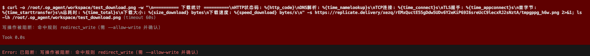
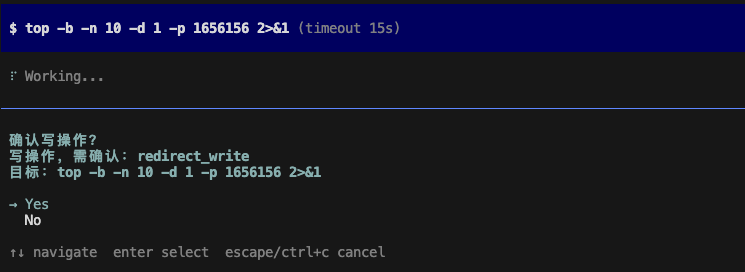

# OpAgent

基于 [pi coding agent SDK](https://pi.dev) 构建的轻量化 Linux 运维 Agent。复用 pi 的 agent loop、工具、会话、技能、TUI 与 provider，在此之上增加安全优先的运维层：四层安全策略（模式层 / LLM 语义审计 / 确认门 + 审计链 / run_script OS 沙箱）、防篡改审计链、运维工具/技能，以及可插拔的监控与报警系统。

- **轻量化**：单 Bun 进程 + 内嵌 SQLite，无 Redis/Mongo/Milvus，可在 1c1g 服务器运行。
- **安全第一**：破坏性操作默认阻断；写操作需确认；全程审计。
- **交互式**：pi 风格 TUI 对话框；监控可对话式定义，无需手写 YAML。
- **可插拔**：自定义 collector/notifier 为 TypeScript 文件，热加载。

> 详细设计文档：[design.md](design.md) · [monitor_design.md](monitor_design.md) · [coding_desc.md](coding_desc.md)

---

## 项目说明

OpAgent 专为**轻量化 Linux 运维**设计：单 Bun 进程 + 内嵌 SQLite，可在 1c1g 服务器轻松运行，辅助日常运维——检查、监控、执行、报警、脚本生成、安全审查。核心约束是**安全**：agent 绝不主动删除文件或数据库记录，且每个动作都可审计。

### 安全优先设计

所有模型提议的动作在执行前都要经过**四层防御**。拦截发生在 pi 的 `tool_call` 钩子（执行前），模型无法绕过。

| 层级                          | 作用                                                                                                                                                                                                                                                                                                                                                                                                                                                                                                                                                                                                                                                      | 代码                                                                                            |
| ----------------------------- | --------------------------------------------------------------------------------------------------------------------------------------------------------------------------------------------------------------------------------------------------------------------------------------------------------------------------------------------------------------------------------------------------------------------------------------------------------------------------------------------------------------------------------------------------------------------------------------------------------------------------------------------------------- | ----------------------------------------------------------------------------------------------- |
| 1. 模式层（`PolicyGuard`）    | 快速确定地阻断破坏性命令（`rm -rf`、`mkfs`、`find -delete`、`\| sh`、`eval`、`base64\|sh`、解释器删除与解释器写文件 `python open('w')`）、危险 SQL（`DROP`/`TRUNCATE`/无 `WHERE` 的 `DELETE`）、**写 SQL**（`INSERT`/`UPDATE`/`CREATE`/`ALTER`/`GRANT`…）、**NoSQL 数据源写**（`redis-cli SET/DEL/FLUSHALL`、`mongosh insertOne/updateOne/drop`…）、硬保护路径（`/etc/shadow`、`~/.ssh`、`/proc`、`/sys`、`/dev`、`/boot`）。文件写分区判定：scratch 临时区（`/tmp`）免确认放行、`/dev/null` 丢弃视为只读、其余默认阻断；系统环境变更（服务/进程/包管理/挂载/crontab）与数据源写**永不享受 scratch 豁免**；symlink 逃逸与 `..` 穿越经 realpath/规范化拦截 | [src/safety/policy.ts](src/safety/policy.ts) · [src/safety/patterns.ts](src/safety/patterns.ts) |
| 2. LLM 语义层（`LlmAuditor`） | 审计写/脚本的变量间接、混淆、外泄、提权。取严合并——LLM 只能升级，不能降级。fail-safe：异常时升级为人工确认。scratch/discard 区跳过（免确认承诺不被 fail-safe 打破）。                                                                                                                                                                                                                                                                                                                                                                                                                                                                                     | [src/audit/llm.ts](src/audit/llm.ts)                                                            |
| 3. 确认门 + 审计              | 写/破坏性操作需交互 `y/N`；无 UI（print 模式）则 fail-closed 阻断。每条决策与结果入哈希链审计日志。                                                                                                                                                                                                                                                                                                                                                                                                                                                                                                                                                       | [src/safety/extension.ts](src/safety/extension.ts) · [src/audit/store.ts](src/audit/store.ts)   |
| 4. OS 沙箱（`SandboxRunner`） | `run_script` 生成的脚本在 OS 沙箱中执行（macOS `sandbox-exec` / Linux `bwrap`）：**进程级**强制只可写 scratch 区与 `/dev/null`，读取/执行/网络不受限（只读分析是核心用例）。自动探测可用性：`auto`（默认，不可用回退模式层并审计警告）、`require`（不可用拒绝执行）。直接 `bash /tmp/x.sh` 被第 1 层阻断——scratch 脚本一律经 `run_script` 走沙箱                                                                                                                                                                                                                                                                                                          | [src/safety/sandbox.ts](src/safety/sandbox.ts) · [src/tools/script.ts](src/tools/script.ts)     |

### 安全演示

|             默认阻塞 (Blocked)             |          开启 `--allow-write` (需确认)           |
| :----------------------------------------: | :----------------------------------------------: |
|  |  |

**保证：**

- 删除类工具（`controlled_delete`、`db_mutate`）始终注册，但受运行时安全级别门禁控制——破坏性动作还需 `destructive` 级别 + 确认 + 理由（[src/tools/destructive.ts](src/tools/destructive.ts)）。
- **默认只读模式只能写 scratch 临时区**（`/tmp`，免确认，用于生成脚本与辅助文档）与 `/dev/null`（丢弃输出，视为只读）；其余任何路径写入、系统环境变更（服务/进程/包管理/挂载/crontab）、数据源写（SQL 写与 redis/mongo 写命令）一律阻断；只读查询不受影响。
- `write`/`edit` 工具默认可用，但被 `PolicyGuard` 限制在 scratch 区（`OPAGENT_SCRATCH_PATHS` 可配）；白名单写入仍需 `--allow-write` + 逐次确认。
- scratch 脚本必须走 `run_script`（直接 `bash /tmp/x.sh` 被阻断，内容未经校验）；沙箱内写边界由 OS 强制。
- 运行命令/SQL 的 collector 也过 `PolicyGuard`（防御纵深）——[src/monitor/builtin/collectors/file_sql_cmd.ts](src/monitor/builtin/collectors/file_sql_cmd.ts)。
- 生成脚本走 `run_script`：`bash -n` 语法检查 → `dry_run` 预览 → 模式+LLM 审计 → 确认 → **OS 沙箱内执行**（[src/tools/script.ts](src/tools/script.ts)）。

### 会话内安全级别（临时升降）

只读排查往往以一份需要执行的方案收尾。无需带 `--allow-write` 重启 agent，可以**在会话内临时提升安全级别，执行完再降回只读**（[src/safety/level.ts](src/safety/level.ts) · [src/safety/level-extension.ts](src/safety/level-extension.ts)）：

| 级别          | 门禁                                            | 典型场景           |
| ------------- | ----------------------------------------------- | ------------------ |
| `readonly`    | 仅 scratch + `/dev/null` 可写；其余一律阻断     | 默认。排查与汇报   |
| `write`       | 白名单写 + 系统写放行（逐次确认）；破坏性仍阻断 | 执行方案           |
| `destructive` | 写放行 + 破坏性通道（二次确认 + 理由）          | 少量严格受控的清理 |

两种调级方式：

- `/level` 斜杠命令 —— TUI 中交互选择；也可直接传级别（`/level write`）。
- `adjust_level` 工具 —— 模型可**发起**调级请求（附理由），但必须经你在确认对话框中显式批准才生效。模型无法自行提权。

安全语义：

- 提权必须经用户显式确认；降级即时生效、无需确认。
- 每次变更（无论批准还是拒绝）都写入审计链，含批准者与理由。
- 级别变更只翻转 `allowWrite` / `allowDestructive` 两个门禁（以及 OS 沙箱开关）。**硬保护路径在任何级别下都保持阻断。**
- 提权期间状态栏显示当前级别，且每轮系统提示会注入级别说明，提醒模型方案执行完后调用 `adjust_level(mode="readonly")` 降回只读。

### 审计链

每次工具调用决策、LLM 审计结论、执行结果都追加到**哈希链** SQLite 表（`hash = sha256(prev_hash || 字段)`）。任何事后篡改都会断链，可检出。

- 写入/校验/查询：[src/audit/store.ts](src/audit/store.ts)
- slash 命令：`/audit list [n]`、`/audit verify`（[src/audit/extension.ts](src/audit/extension.ts)）
- DB：`~/.op_agent/audit.db`

### 日常运维能力

| 运维需求                                      | 实现                                                                        | 代码                                                                                            |
| --------------------------------------------- | --------------------------------------------------------------------------- | ----------------------------------------------------------------------------------------------- |
| **检查**（磁盘/内存/CPU/网络/服务/进程/日志） | 只读 `inspect_*` 工具，自动执行无需确认                                     | [src/tools/inspect.ts](src/tools/inspect.ts)                                                    |
| **监控**（OS 指标/日志/数据库/命令）          | 定时守护进程 + 可插拔 collector                                             | [src/monitor/](src/monitor/)                                                                    |
| **报警**（飞书/钉钉/webhook/邮件…）           | 可插拔 notifier，自带加签                                                   | [src/monitor/builtin/notifiers/](src/monitor/builtin/notifiers/)                                |
| **执行**（命令/脚本）                         | `bash`（受控 + 注入 `pipefail`/`timeout`）与 `run_script`（lint + dry-run） | [src/safety/extension.ts](src/safety/extension.ts) · [src/tools/script.ts](src/tools/script.ts) |
| **脚本**（生成 bash/python）                  | `run_script` 语法检查 + dry-run 预览                                        | [src/tools/script.ts](src/tools/script.ts)                                                      |
| **安全审查**                                  | 只读检查 + `--llm_audit` 对写操作语义复核                                   | [src/safety/](src/safety/) · [src/audit/llm.ts](src/audit/llm.ts)                               |
| **恢复**                                      | 技能驱动的非破坏性 playbook；破坏性仅走确认的 `controlled_delete`           | [skills/](skills/) · [src/tools/destructive.ts](src/tools/destructive.ts)                       |

### 轻量化设计

- 单 Bun 进程 + 内嵌 `bun:sqlite`——无 Redis/Mongo/Milvus。
- 只读检查跳过 LLM 审计层（仅在写/脚本上付出延迟与成本）。
- 监控守护进程 headless 运行，例行检查不消耗 LLM。
- `bun build --compile` → 单文件二进制，便于目标机部署。

---

## 环境要求

- [Bun](https://bun.sh) 运行时（会自动加载 `.env`）
- DeepSeek API key（默认模型）或任意 pi 支持的 provider key

## 安装

### 方式一：从 npm 安装（推荐用户使用）

```bash
# 使用 npm 全局安装
npm install -g @xianzongwendao/op-agent

# 或使用 bun
bun add -g @xianzongwendao/op-agent

# 或不安装直接运行
npx @xianzongwendao/op-agent
```

### 方式二：从源码构建（开发者）

```bash
git clone https://github.com/liveljack/op_agent.git
cd op_agent
bun install
```

## 快速开始

```bash
# 1. 配置 API key（见下方"LLM 配置"）
mkdir -p ~/.op_agent
echo 'DEEPSEEK_API_KEY=sk-xxxxxxxx' > ~/.op_agent/.env
chmod 600 ~/.op_agent/.env

# 2. 自检（离线，不调用 LLM）
opagent --self-test

# 3. 启动交互式 TUI
opagent
```

---

## LLM 配置

### 配置来源优先级（高 → 低）

1. **CLI 参数** —— `--model`、`--allow-write`、`--llm_audit` …
2. **`process.env`** —— 真实环境变量 + Bun 自动加载的 `<cwd>/.env`
3. **`~/.op_agent/.env`** —— 全局配置文件；仅填充前两层未设置的键

`~/.op_agent/.env` 是存放密钥的推荐位置（全局、0600 权限、不进 git）：

```bash
DEEPSEEK_API_KEY=sk-xxxxxxxx
# 可选开关
# OPAGENT_ALLOW_WRITE=1
# OPAGENT_LLM_AUDIT=1
```

### API key

| 变量               | 用途                          |
| ------------------ | ----------------------------- |
| `DEEPSEEK_API_KEY` | DeepSeek API 密钥（默认模型） |
| `OPAGENT_API_KEY`  | 通用兜底密钥                  |

### URL

- **主模型**：pi 内置 DeepSeek provider 端点固定，**无需配置 URL**，只需 key。
- **自定义 / 兼容端点**（代理、自部署、OpenAI 兼容服务）：在 `~/.op_agent/models.json` 定义自定义 provider（pi 机制），再设 `OPAGENT_MODEL=<provider>/<model>`。示例 `models.json`：
  ```json
  {
    "my-openai": {
      "baseUrl": "https://your-endpoint/v1",
      "apiKey": "$YOUR_API_KEY",
      "api": "openai-completions",
      "models": [
        {
          "id": "gpt-4o",
          "name": "GPT-4o",
          "reasoning": false,
          "input": ["text"],
          "contextWindow": 128000,
          "maxTokens": 4096,
          "cost": { "input": 0, "output": 0, "cacheRead": 0, "cacheWrite": 0 }
        }
      ]
    }
  }
  ```
  然后：`OPAGENT_MODEL=my-openai/gpt-4o opagent`
- **LLM 审计端点**（仅 `--llm_audit` 时）：`OPAGENT_AUDIT_BASE_URL`（默认 `https://api.deepseek.com`）、`OPAGENT_AUDIT_MODEL`（默认 `deepseek-chat`）、`OPAGENT_AUDIT_API_KEY`（默认同 `DEEPSEEK_API_KEY`）。

### 切换模型

```bash
# 单次覆盖
opagent --model deepseek/deepseek-v4-flash
opagent --model anthropic/claude-sonnet-4-5   # 需 ANTHROPIC_API_KEY
opagent --model openai/gpt-4o                 # 需 OPENAI_API_KEY

# 或写入 ~/.op_agent/.env 持久化
OPAGENT_MODEL=deepseek/deepseek-v4-pro
```

查看某 provider 可用模型：设置好 key 后运行 `pi --list-models`（或在 TUI 内用 `/model`）。

> **不要**把密钥放进 `.vscode/settings.json` —— 它是编辑器配置，不是应用配置，常被共享/提交。请用 `~/.op_agent/.env`。（VSCode 的 `terminal.integrated.env.osx` 终端注入可用，但不便携。）

---

## 用法

```bash
opagent                              # 交互式 TUI（默认）
opagent --allow-write                # 开启写操作（仍逐次确认）
opagent --allow-destructive          # 开启破坏性通道（仍需确认 + 理由）
opagent --llm_audit                  # 对写/脚本启用 LLM 语义审计
opagent -p "检查磁盘使用"             # headless 单次执行
opagent --self-test                  # 离线自检
opagent monitor                      # 启动监控守护进程
opagent monitor new-collector <name> # 生成自定义 collector 模板
opagent monitor new-notifier <name>  # 生成自定义 notifier 模板
```

会话内调级（无需重启）：

```text
/level                    # 查看/切换安全级别（readonly / write / destructive）
/level write              # 直接切换到写级别
adjust_level 工具          # 模型发起调级请求，需你在对话框中确认
```

### 参数与环境变量

| 参数                  | 环境变量                      | 默认                         | 说明                                                                                                |
| --------------------- | ----------------------------- | ---------------------------- | --------------------------------------------------------------------------------------------------- |
| `--model`             | `OPAGENT_MODEL`               | `deepseek/deepseek-v4-flash` | 模型 `provider/model`                                                                               |
| `--allow-write`       | `OPAGENT_ALLOW_WRITE=1`       | 关                           | 开启写操作（需确认）                                                                                |
| `--allow-destructive` | `OPAGENT_ALLOW_DESTRUCTIVE=1` | 关                           | 开启破坏性操作（需确认 + 理由）                                                                     |
| `--llm_audit`         | `OPAGENT_LLM_AUDIT=1`         | 关                           | LLM 语义审计                                                                                        |
| `--cwd`               | —                             | `process.cwd()`              | 工作目录                                                                                            |
| `-p, --print`         | —                             | —                            | headless 单次                                                                                       |
| —                     | `OPAGENT_DIR`                 | `~/.op_agent`                | 配置目录                                                                                            |
| —                     | `OPAGENT_WRITE_PATHS`         | `<cwd>/workspace`            | 写白名单（冒号分隔）                                                                                |
| —                     | `OPAGENT_SCRATCH_PATHS`       | `/tmp`                       | scratch 临时区，免确认可写（冒号分隔；只应指向真正的临时目录）                                      |
| —                     | `OPAGENT_SANDBOX`             | `auto`                       | `run_script` OS 沙箱：`auto`（可用则沙箱、不可用回退+审计警告）/ `require`（不可用拒绝执行）/ `off` |
| —                     | `OPAGENT_AUDIT_DB`            | `~/.op_agent/audit.db`       | 审计 DB 路径                                                                                        |

---

## 安全模型（四层）

1. **模式层**（`PolicyGuard`）：快、确定。阻断 `rm -rf`、`mkfs`、`find -delete`、`| sh`、`eval`、`base64|sh`、解释器删除（`python os.remove`、`perl unlink`…）与解释器写文件（`python open('w')`、`node writeFileSync`）、危险 SQL（`DROP`/`TRUNCATE`/无 `WHERE` 的 `DELETE`）、**写 SQL**（`INSERT`/`UPDATE`/`CREATE`/`ALTER`/`GRANT`/`REPLACE`/`MERGE`）、**NoSQL 数据源写**（`redis-cli SET/DEL/FLUSHALL`、`mongosh insertOne/updateOne/deleteOne/drop` 等），以及硬保护路径（`/etc/shadow`、`~/.ssh`、`/proc`、`/sys`、`/dev`、`/boot`）。文件写按落区分判：scratch（`/tmp`）免确认、`/dev/null` 丢弃视为只读、其余需 `--allow-write`；系统状态变更（服务/进程/包管理/挂载/crontab）永不 scratch 豁免；symlink 逃逸与 `..` 穿越被解析拦截。
2. **LLM 层**（`LlmAuditor`，`--llm_audit`）：对写/脚本做语义审计——抓变量间接、混淆、外泄、提权。取严合并（LLM 只能升级，不能降级）。fail-safe：异常时升级为人工确认。scratch/discard 区跳过（免确认承诺不被破坏）。
3. **确认门 + 审计**：写/破坏性操作需交互 `y/N`；每条决策与执行结果写入哈希链审计日志。
4. **OS 沙箱**（`SandboxRunner`，默认只读模式启用）：`run_script` 脚本在 `sandbox-exec`（macOS）/ `bwrap`（Linux）中执行——进程级写隔离到 scratch 区与 `/dev/null`；读取、执行、网络不受限。`OPAGENT_SANDBOX=auto|require|off` 控制不可用时的行为；每次沙箱执行/回退/拒绝都入审计链。直接执行 scratch 脚本（`bash /tmp/x.sh`）在第 1 层被阻断——脚本必须经 `run_script`。

安全等级与参数绑定：`--allow-write` / `--allow-destructive` 决定启动级别与 LLM 审计可放行的范围；会话内可通过 `/level` 或 `adjust_level` 临时升降（见「会话内安全级别」）。`/audit list`、`/audit verify` slash 命令查询与校验审计链。

删除类工具（`controlled_delete`、`db_mutate`）始终注册，但受运行时安全级别门禁控制——破坏性动作还需 `destructive` 级别 + 确认 + 理由。

已知残余面（文档明示，由 2–4 层缓解）：`find -exec`、二进制间接执行、bash 工具（非 run_script）内动态构造的写路径——模式层尽力拦截，沙箱路径为强制。

---

## 监控与报警

两套可插拔扩展 + 守护进程 + 对话式设置。

### 内置 Collector

`system.cpu` · `system.mem` · `system.disk` · `system.net` · `file.tail` · `sql` · `command.read`
（prometheus/grafana/http/journald 规划中）

### 内置 Notifier

`log` · `webhook` · `feishu` · `dingtalk`（email/slack/telegram 规划中）

### 守护进程

```bash
opagent monitor          # 定时采集 → 条件评估 → 告警 → 通知
                         # SIGHUP 热加载配置与插件
```

配置文件（由 TUI 工具自动生成，也可手写）：

- `~/.op_agent/monitors.yaml`
- `~/.op_agent/notifiers.yaml`

示例：

```yaml
# notifiers.yaml
notifiers:
  - id: feishu-ops
    type: feishu
    params: { webhook_url: 'https://open.feishu.cn/...', secret: '${FEISHU_SECRET}' }

# monitors.yaml
monitors:
  - id: disk-root
    collector: system.disk
    params: { mount: '/' }
    when: { field: usage_percent, op: '>', value: 85 }
    for: 2m
    severity: warn
    interval: 60s
    notifiers: [feishu-ops]
    cooldown: 5m
```

### 对话式设置

在 TUI 里直接说要监控什么——agent 读取插件的 `paramsSchema`，提问参数、试采集一次、发测试通知、落配置：

> "监控磁盘，超 85% 飞书通知我"

agent 通过 `monitor_*` 工具操作（`monitor_list_collectors`、`notifier_add`、`monitor_add`、`monitor_test`…）。配置写入需写级别（启动时 `--allow-write`，或会话内经 `/level` / `adjust_level` 临时提升）。

### 自定义插件

```bash
opagent monitor new-collector my-monitor      # → ~/.op_agent/monitor/my-monitor.ts
opagent monitor new-notifier my-channel       # → ~/.op_agent/notification/my-channel.ts
```

编辑生成的模板，`kill -HUP <守护进程pid>`（或重启）加载。声明 `paramsSchema` 后对话式设置自动识别；敏感字段标 `{ secret: true }` 自动脱敏。

---

## 项目结构

```
src/
├── index.ts              # CLI 入口（TUI / print / monitor 子命令）
├── config.ts             # 环境配置（三级优先级 + ~/.op_agent/.env 加载）
├── prompt.ts             # 运维系统提示词
├── safety/               # PolicyGuard + safety 扩展 + 模式规则
├── audit/                # 哈希链审计 + LLM 审计器
├── tools/                # inspect / run_script / destructive 工具
├── skills/               # 内置技能加载
└── monitor/              # 监控守护进程 + collectors/notifiers/工具
skills/                   # 内置 SKILL.md
test/                     # bun 测试
design.md · monitor_design.md · coding_desc.md
```

## 开发

```bash
bun test          # 运行测试
bun run typecheck # tsc --noEmit
bun run dev       # 热重载开发
```

## License

[Apache License 2.0](LICENSE)
