# OpAgent 代码实现与设计详解

> 轻量化 Linux 运维 Agent，基于 `@earendil-works/pi-coding-agent` 构建。
> 本文逐模块讲解当前实现，所有图例使用 mermaid。

---

## 一、总体架构与设计哲学

### 核心判断

pi（`@earendil-works/pi-coding-agent`）已经是一个**完整的 coding agent harness**——自带 agent loop、工具（read/bash/edit/write/grep/find/ls）、会话管理、Agent Skills 标准、扩展机制、多 provider、TUI/RPC 模式。

因此 OpAgent **不重造内核**，而是 pi 之上的"运维 + 安全"扩展层。OpAgent 只负责 pi 不提供、但运维场景必需的部分：**安全策略 + 审计链 + 运维工具 + 运维技能 + 运维系统提示词**。

### 架构图

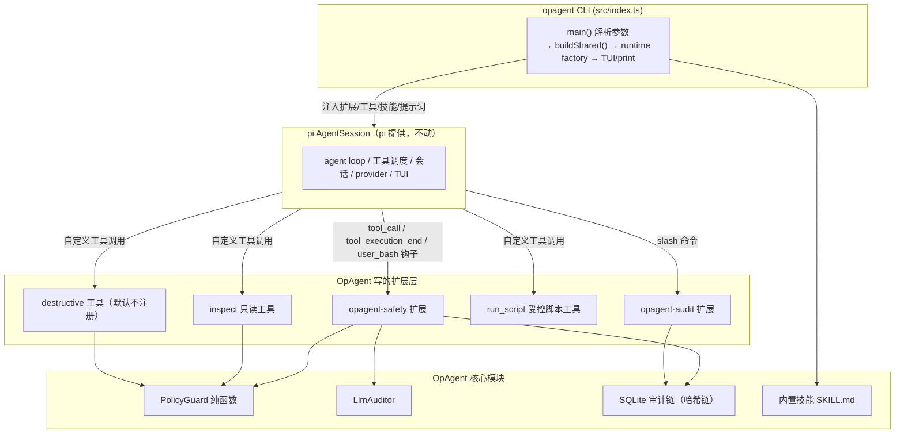

### 接入 pi 的关键机制：extension（扩展）

pi 在工具执行**前**触发 `tool_call` 事件，OpAgent 在这里拦截、判定、阻断或确认。这是"在 pi 内核层拦截，模型无法绕过"的根本——拦截发生在工具真正执行之前，模型即使想绕过也无路径。

### 分工

| 责任方 | 负责 |
|---|---|
| pi | 对话、流式输出、工具调度、会话管理、模型调用、TUI |
| OpAgent | 三层安全策略、哈希链审计、运维工具、运维技能、运维系统提示词 |

---

## 二、启动流程（src/index.ts）

### 流程图

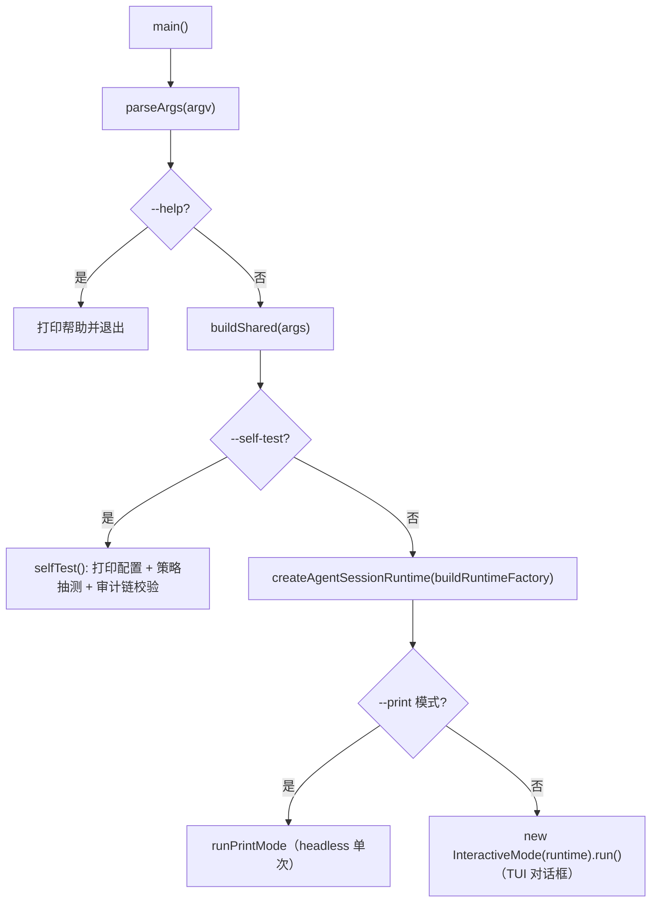

### buildShared —— 装配点（index.ts L126）

`buildShared` 是 OpAgent 所有部件的装配中心：

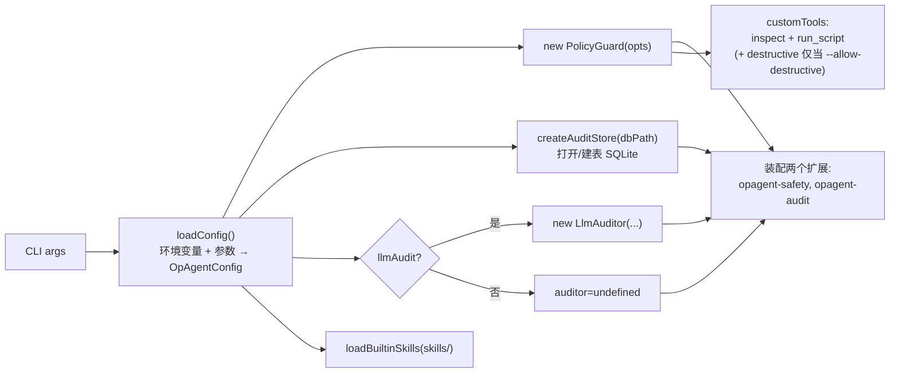

### runtime factory（index.ts L208）

`buildRuntimeFactory` 返回 pi 的 runtime factory，闭包持有 `authStorage`/`modelRegistry`/`settingsManager`。pi 调用它时：

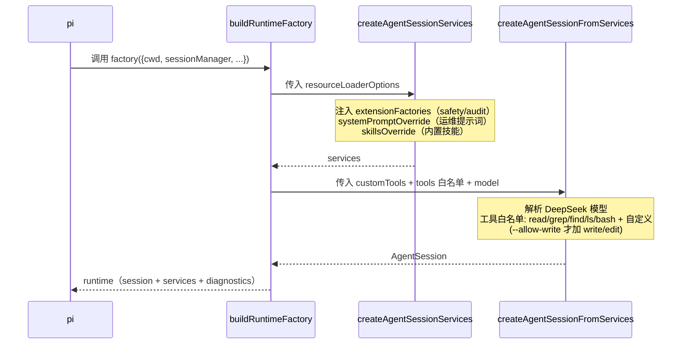

### 关键设计点

- **模型解析**（`resolveModel` L178）：拆 `provider/model`，`setRuntimeApiKey` 注入 key，`resolveCliModel` 解析。默认 `deepseek/deepseek-v4-flash`。解析失败不崩溃，回落 pi 第一个可用模型。
- **工具白名单**（`buildToolAllowlist` L202）：默认 `read,grep,find,ls,bash` + 自定义工具名；`--allow-write` 才加 `write,edit`。**这是第一道闸——默认根本不把写工具暴露给模型。**
- **`--self-test`**（L251）：不连 LLM，离线打印配置 + 策略抽测 + 审计链校验，用于验证装配。

---

## 三、安全模型（核心）—— 三层防御

### 设计原则

**模式层快而确定（先判）→ LLM 层慢而语义（后审）→ 确认门 + 审计（兜底）**，三层取严合并。

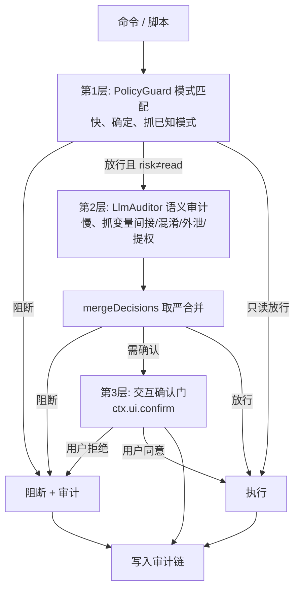

### 第 1 层：模式规则表（src/safety/patterns.ts）

四张正则表 + 两组路径规则：

| 表 | 内容 | 命中风险 |
|---|---|---|
| `DESTRUCTIVE_COMMAND_PATTERNS` | `rm -rf`/`mkfs`/`dd of=/dev/`/fork炸弹/`shutdown`/`find -delete`/`xargs rm`/`find -exec rm`/`| sh`/`eval`/`base64\|sh`/解释器删除(python os.remove/perl unlink/node rmSync/ruby) | destructive |
| `DESTRUCTIVE_SQL_PATTERNS` | `DROP`/`TRUNCATE`/无`WHERE`的`DELETE`/`ALTER DROP` | destructive |
| `WRITE_COMMAND_PATTERNS` | `systemctl restart`/`service`/`kill`/`apt install`/`chmod`/重定向/`mv cp`/`dd of=`/`crontab -e` | write |
| `PROTECTED_PATH_PATTERNS` | `/boot /proc /sys /dev /etc/shadow /etc/passwd /etc/ssh /root/.ssh ...` | 永远阻断 |
| `PROTECTED_HOME_RELATIVE` | `~/.ssh`/`.bashrc`/`.profile`/`.bash_history`/gnupg/keychain | 永远阻断 |

这些规则经过绕过探针验证补全（`find -delete`、`base64|sh`、解释器删除、`eval` 等都已覆盖）。

### 第 2 层：PolicyGuard 纯函数（src/safety/policy.ts）

`PolicyGuard` 是无 IO 的纯类，所有判定可单测。核心是 `checkBash(command)`（L65），决策顺序：

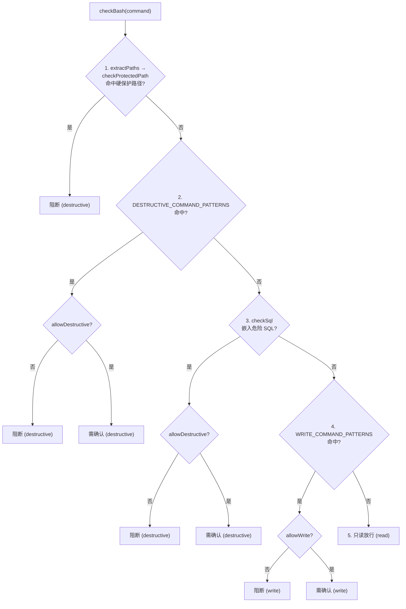

返回 `PolicyDecision { allow, risk, requireConfirm, reason, matches }`。

**关键设计点**：

- `checkProtectedPath`（L298）只查硬保护，**不**强制写白名单——因为路径出现在命令里不代表在写它（可能只是 `cat`）。写白名单由写命令模式命中后再过 `checkPath`。这个区分避免了"读命令被误拦"。
- `checkPath`（L203）处理 write/edit/delete 工具的路径：硬保护优先 → 写必须 `allowWrite` 且在白名单内。
- `checkDeletePath`（L174）删除一律 destructive，即使路径合法也必须 `--allow-destructive` + 确认。

### 接入点：safety 扩展（src/safety/extension.ts）

PolicyGuard 与 pi 的桥梁。注册三个 pi 钩子：

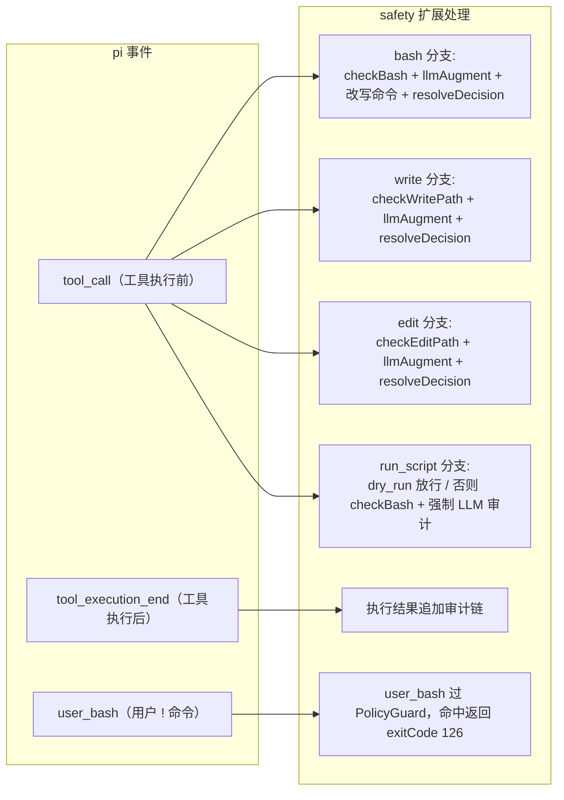

**`resolveDecision`**（L197）把 `PolicyDecision` 翻译成 pi 的返回值：

| 决策 | 处理 |
|---|---|
| `!allow` | `{block:true, reason}` + 审计 + UI 报错 |
| `requireConfirm` + 有 UI | `ctx.ui.confirm()` 弹确认，记录 approver |
| `requireConfirm` + 无 UI（print 模式） | **保守阻断**（无人确认就不放行） |
| 都通过 | `undefined`（放行） |

### 第 3 层：LLM 语义审计（src/audit/llm.ts）

模式层抓不到的语义绕过（变量间接 `a=rm;$a`、外泄 `cat x \| nc`、提权 `sudo`），交给 LLM。

`LlmAuditor.audit()`（L107）流程：

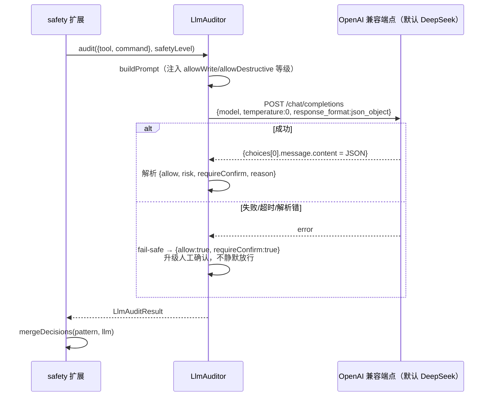

**`mergeDecisions`**（L46）—— 取严合并，这是安全保证：

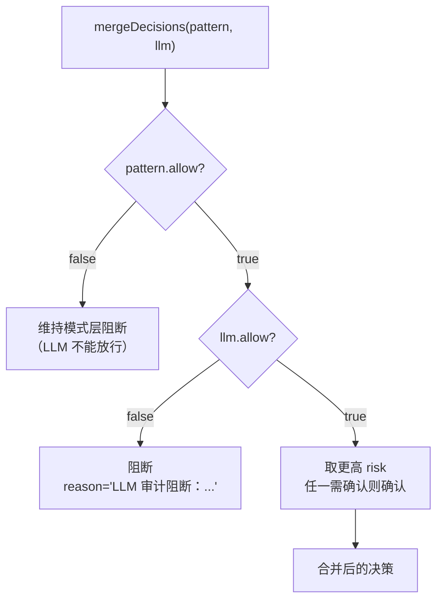

**核心不变量**：**LLM 只能升级，永远不能降级模式层判定。**

**fail-safe**（L107）：审计请求失败/超时/解析错 → 返回 `requireConfirm:true`，升级为人工确认，绝不静默放行。无 key → 跳过（并警告）。

**触发范围**（`llmAugment` L36）：只读跳过（省延迟成本），仅写/破坏性命令与脚本触发。每次 LLM 审计单独写一条 `tool=llm_audit` 审计记录。

---

## 四、审计链（src/audit/）

### 存储：SQLite + 哈希链

**db.ts**：`bun:sqlite` 单文件，WAL 模式，建 `audit` 表（seq 自增 + 业务字段 + `prev_hash` + `hash`）。

**store.ts** 哈希链结构：

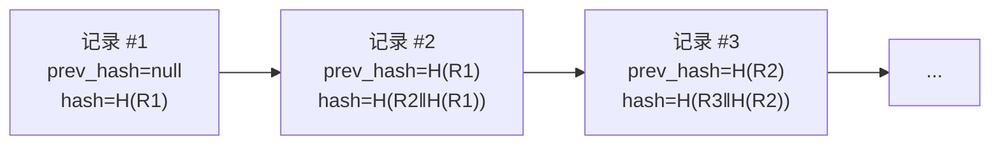

每条记录的 `hash = sha256(prev_hash || canonical(所有业务字段))`。任何字段被篡改，或任何一条 prev_hash 被改写，都会导致后续链断裂。

**三个方法**：

| 方法 | 作用 |
|---|---|
| `append`（L63） | 取上一条 hash → computeHash → 插入 |
| `verify`（L106） | 从头重算每条 hash 比对存储值，任一不符返回 `brokenAt` |
| `list` | 倒序查最近 N 条 |

`computeHash`（L46）把所有字段拼成规范串再 sha256，**含 prev_hash**，形成链。任何事后篡改都会断链，`/audit verify` 一键检出。

### 查询：audit 扩展（src/audit/extension.ts）

只注册一个 slash 命令 `/audit`：

- `/audit list [n]` —— 打印最近 n 条（含 BLOCKED/OK 标记、命中规则、原因）
- `/audit verify` —— 校验哈希链完整性

审计写入由 safety 扩展驱动，本扩展只负责查询。

### 审计记录的完整性来源

每次 tool_call 产生**最多三类记录**，都进哈希链：

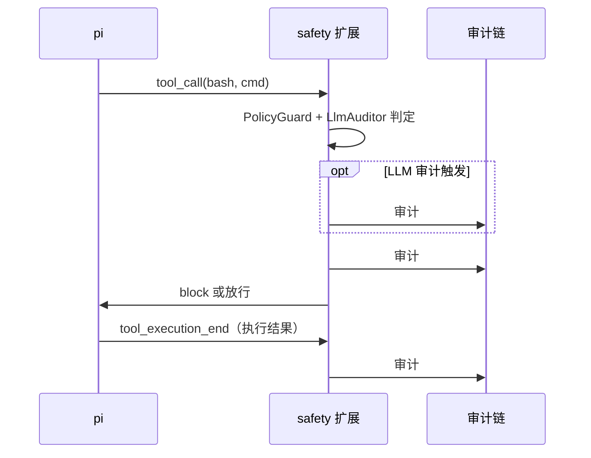

事后 `/audit verify` 校验哈希链完整；`/audit list` 可追溯"谁在何时确认了什么"。

---

## 五、工具体系

### 只读检查工具（src/tools/inspect.ts）

7 个 `defineTool`：`inspect_disk/mem/cpu/net/service/proc` + `read_logs`。

特点：
- 全部 `risk=read`，自动执行无需确认
- 内部用 `guardedRun()`（L12）执行：**虽然命令固定只读，仍过 `guard.checkBash` 防御纵深**——非 read 一律拒绝；加 `set -o pipefail` + 30s 超时
- 参数净化：`inspect_service` 服务名只允许 `[a-zA-Z0-9_.@-]`，`read_logs` 禁 `..` 路径穿越

### 受控脚本工具（src/tools/script.ts）

`run_script` —— 系统提示词要求模型生成脚本必须优先用它。流程：

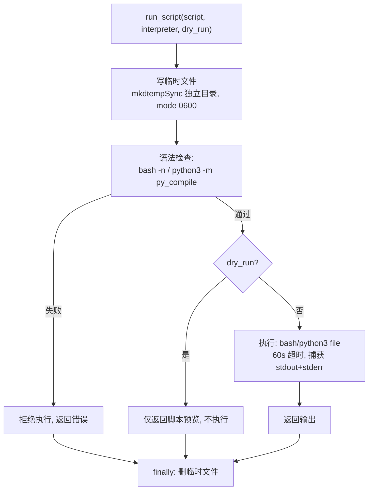

**注意**：`run_script` 的安全决策不在工具内，而在 safety 扩展的 `tool_call`（脚本全文过 PolicyGuard + 强制 LLM 审计）。工具只做语法校验和执行。

### 破坏性工具（src/tools/destructive.ts）

`controlled_delete` + `db_query`。**默认完全不注册**——只有 `--allow-destructive` 时 `buildShared` 才把它们加入 `customTools`（index.ts L169）。

即使注册后仍有多重门：
- `controlled_delete` 必须填 `reason` → 过 `guard.checkDeletePath`（白名单 + 硬保护）→ safety 扩展二次确认
- `db_query` 过 `guard.checkSql`，破坏性 SQL 被阻；当前为 dry-run 占位（实际执行待接入 `Bun.sql`）

### 工具注册矩阵

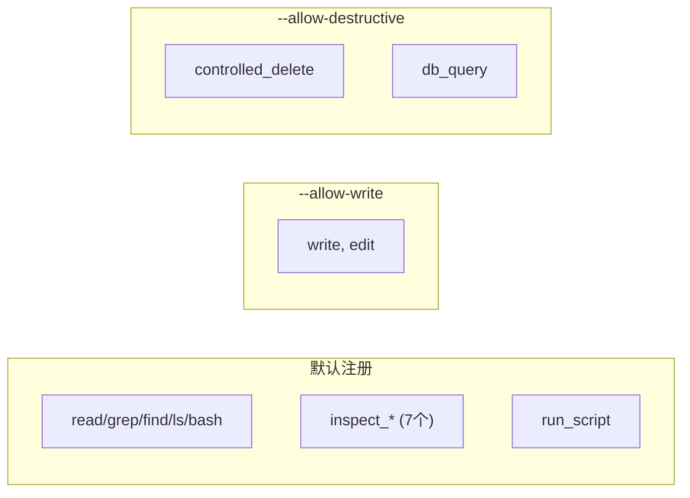

---

## 六、技能体系（src/skills/index.ts）

直接采用 pi 的 **Agent Skills 标准**：`skills/<name>/SKILL.md` + YAML frontmatter（`name`/`description` 必填，`metadata` 扩展 `category`/`risk`/`tags`）。

`loadBuiltinSkills`（L13）用 pi 官方 `loadSkillsFromDir` 扫描，返回标准 `Skill[]`，在 runtime factory 的 `skillsOverride`（index.ts L226）注入 pi。

pi 自动做 **progressive disclosure**：

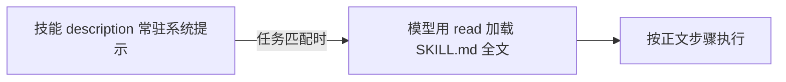

天然轻量，不占 context。当前内置 3 个：`inspect-disk-usage`/`check-service-health`/`analyze-logs`。`/skill:name` 可强制加载。

---

## 七、配置与系统提示词

### 配置（src/config.ts）

`loadConfig` 合并 CLI overrides + 环境变量：

| 字段 | 来源 | 默认 |
|---|---|---|
| `model` | `OPAGENT_MODEL` | `deepseek/deepseek-v4-flash` |
| `apiKey` | `DEEPSEEK_API_KEY`/`OPAGENT_API_KEY` | - |
| `allowWrite` | `--allow-write`/`OPAGENT_ALLOW_WRITE=1` | false |
| `allowDestructive` | `--allow-destructive`/`OPAGENT_ALLOW_DESTRUCTIVE=1` | false |
| `llmAudit` | `--llm_audit`/`OPAGENT_LLM_AUDIT=1` | false |
| `writePaths` | `OPAGENT_WRITE_PATHS` | `<cwd>/workspace` |
| `auditDbPath` | `OPAGENT_AUDIT_DB` | `~/.opagent/audit.db` |
| `auditBaseUrl/Model/ApiKey` | `OPAGENT_AUDIT_*` | DeepSeek 端点 / `deepseek-chat` / 同 DEEPSEEK key |

### 系统提示词（src/prompt.ts）

`buildSystemPrompt` 注入：
1. **运维人设 + 安全红线**：只读优先、绝不主动删文件/删库、写必确认、不碰敏感路径
2. **当前策略状态**：明确告诉模型 write/destructive 是否开启、白名单目录
3. **行为准则**：生成脚本必须用 `run_script` 且先 `dry_run`

在 runtime factory 的 `systemPromptOverride` 注入 pi。

---

## 八、端到端示例

### 示例 1：阻断 `rm -rf /tmp/x`（默认严格模式）

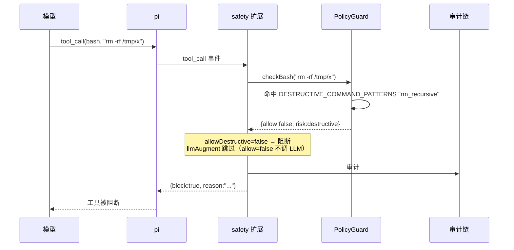

### 示例 2：合法写操作 `systemctl restart nginx`（--allow-write --llm_audit）

```mermaid
sequenceDiagram
  participant M as 模型
  participant PI as pi
  participant S as safety 扩展
  participant G as PolicyGuard
  participant L as LlmAuditor
  participant U as 用户(TUI)
  participant DB as 审计链

  M->>PI: tool_call(bash, "systemctl restart nginx")
  PI->>S: tool_call 事件
  S->>G: checkBash(...)
  G-->>S: {allow:true, risk:write, requireConfirm:true}
  S->>L: audit（allow=true && risk≠read）
  L-->>S: {allow:true, requireConfirm:true, reason:"..."}
  S->>DB: 审计 #1: tool=llm_audit, LLM verdict
  S->>S: mergeDecisions → 仍需确认
  S->>U: ctx.ui.confirm("确认写操作？")
  U-->>S: 同意
  S->>DB: 审计 #2: tool=bash, approver=user, blocked=false
  S-->>PI: 放行（命令改写为 set -o pipefail; systemctl restart nginx; timeout=120s）
  PI->>PI: 执行 bash
  PI->>S: tool_execution_end（结果）
  S->>DB: 审计 #3: tool=bash, result=输出
  PI-->>M: 执行结果
```

### 示例 3：脚本绕过 `find / -delete` 被 LLM+模式双层拦截

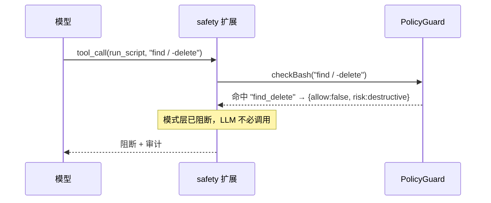

事后 `/audit verify` 校验哈希链完整；`/audit list` 可追溯"谁在何时确认了什么"。

---

## 九、当前限制与设计权衡（如实说明）

1. **模式层是正则，非语义完备**：虽已覆盖常见绕过，但理论上仍有空间（如 `nc` 外泄未一刀切、深层编码）。LLM 审计层补这个洞，但 LLM 本身非 100% 可靠——故取严合并 + 人工确认兜底。
2. **强隔离靠 OS**：pi 明确无内置沙箱。真正的边界是容器/bwrap（P4 计划）。当前模式 + LLM + 确认是"策略层"防御，非隔离边界。
3. **`db_query`/`db_mutate` 是占位**：实际数据库执行待接入 `Bun.sql`（设计已留接口）。
4. **monitor 守护 / cluster 主从**：已在 design.md 规划（P3/P5），尚未实现。
5. **print 模式下写/破坏性操作被自动阻断**：因为无 UI 无法确认——这是有意的 fail-closed，意味着 headless 自动化只适合只读场景，写操作必须人在 TUI 里确认。

---

## 十、验证状态

| 检查 | 结果 |
|---|---|
| `bun test` | 41 pass（PolicyGuard 33 + LLM 审计/合并 8，含 mock OpenAI 端点端到端） |
| `bunx tsc --noEmit` | 0 error（严格模式） |
| `--self-test` | 离线装配自检通过 |
| 绕过探针 | 9/9 危险脚本阻断，`df -h` 正常放行 |

---

## 附录：文件清单

```
src/
├── index.ts              # CLI 入口：装配 + 启动 pi InteractiveMode/print
├── config.ts             # 配置（DeepSeek 默认 + 环境变量合并）
├── prompt.ts             # 运维系统提示词（人设 + 安全红线）
├── safety/
│   ├── patterns.ts       # 危险模式规则表（命令/SQL/路径）
│   ├── policy.ts         # PolicyGuard 纯函数（checkBash/checkPath/...）
│   └── extension.ts      # safety 扩展（tool_call/tool_execution_end/user_bash）
├── audit/
│   ├── db.ts             # bun:sqlite 句柄 + 建表
│   ├── store.ts          # 哈希链 append-only（append/list/verify）
│   ├── extension.ts      # /audit slash 命令
│   └── llm.ts            # LlmAuditor + mergeDecisions
├── tools/
│   ├── inspect.ts        # 7 个只读检查工具
│   ├── script.ts         # run_script（语法检查 + dry-run + 执行）
│   └── destructive.ts    # controlled_delete / db_query（默认不注册）
└── skills/
    └── index.ts          # 用 pi loadSkillsFromDir 加载内置技能

skills/                   # 内置 SKILL.md 技能库
├── inspect-disk-usage/
├── check-service-health/
└── analyze-logs/

test/
├── safety/policy.test.ts # PolicyGuard 单测（33 例）
└── audit/llm.test.ts     # LLM 审计合并 + 端到端 mock（8 例）
```
