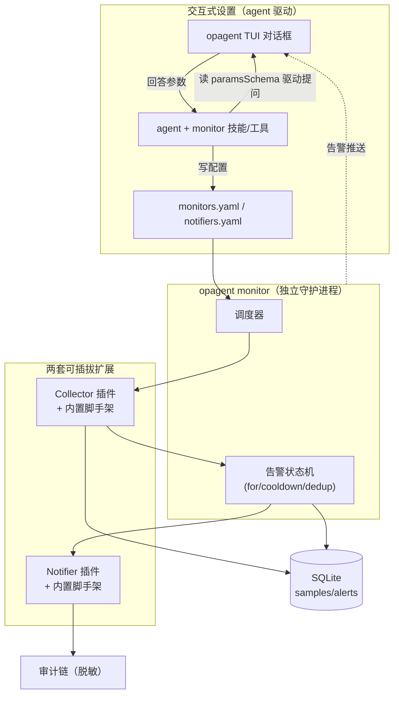
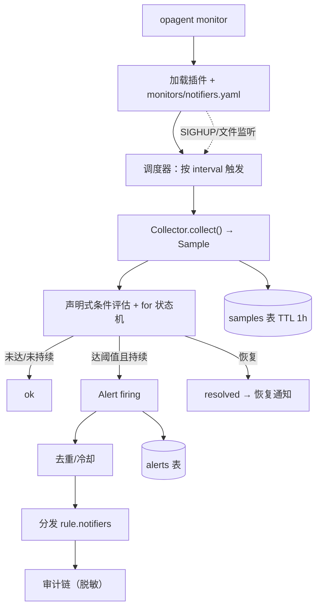
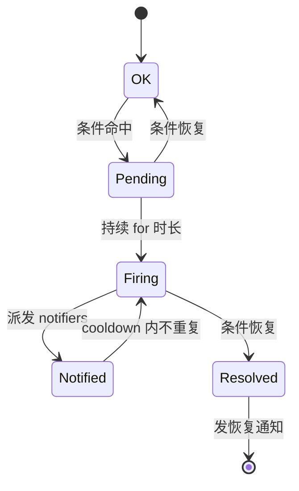
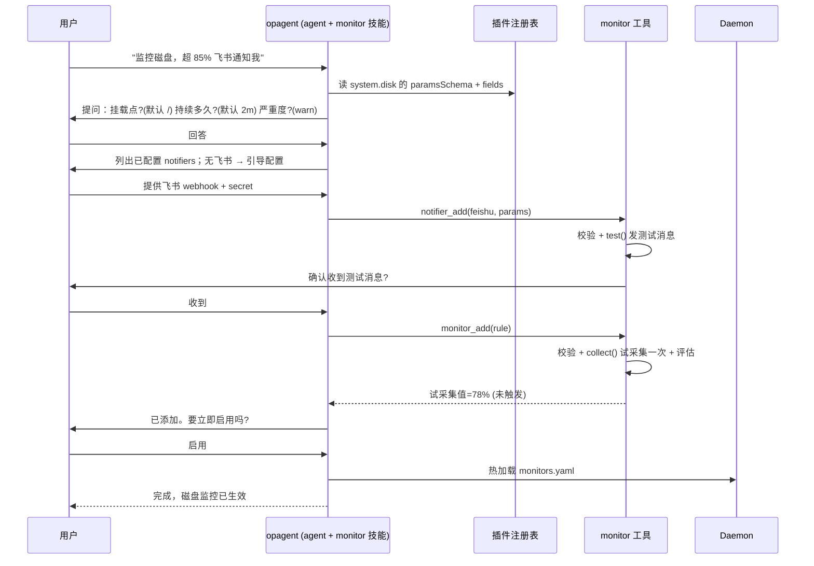
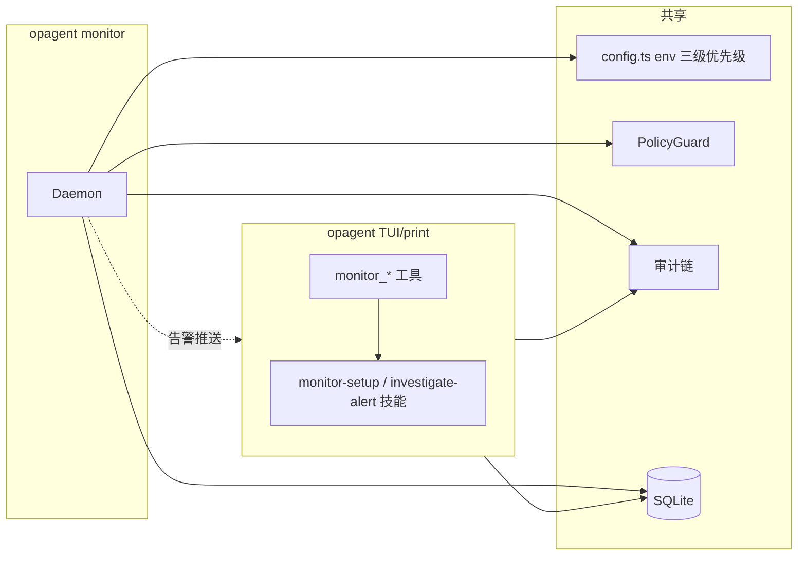

# OpAgent 监控与报警系统设计

> 第二步：可插拔监控采集 + 报警通知，预置常用脚手架，支持通过 opagent 对话框交互式定义，无需手动配置。

---

## 一、设计目标

1. **两套可插拔扩展**：Collector（采集）+ Notifier（通知），正交独立。
2. **预置脚手架**：内置常用 collectors（OS 指标 / 文件分析 / 数据库 / Prometheus / Grafana / HTTP / 命令）与 notifiers（邮件 / 飞书 / 钉钉 / Slack / Telegram / 通用 webhook），开箱即用。
3. **交互式定义**：用户在 opagent 对话框里说"监控磁盘""日志 5xx 告警飞书"，agent 引导填参数、试采集、试通知、落配置——**无需手写 yaml**。
4. **轻量 + 安全**：守护进程单 Bun 进程 + 内嵌 SQLite；采集只读、命令/SQL 过 PolicyGuard；通知端点配置化不暴露给 LLM；全程入审计链。

---

## 二、整体架构



---

## 三、插件接口（含 paramsSchema，支撑交互式设置）

每个插件声明 `paramsSchema`（typebox/JSON Schema），agent 读取它来动态生成提问——**新增插件自动被交互式设置支持**。

### Collector

```ts
import { Type, type TObject } from "typebox";

interface Collector {
  type: string;                       // "system.disk" | "file.tail" | "prometheus" | ...
  paramsSchema: TObject;              // 参数 schema（agent 据此提问）
  fields: string[];                   // 产出字段名（供 rule 条件引用）
  collect(params: Record<string, unknown>, ctx: CollectCtx): Promise<Sample>;
}
interface Sample {
  ts: number;
  fields: Record<string, number | string>;
  labels?: Record<string, string>;
}
interface CollectCtx {
  host: string;
  history: (monitorId: string, windowMs: number) => Sample[]; // 供 window/rate 计算
  guard: PolicyGuard;                // 命令/SQL 类采集必经
}
```

### Notifier

```ts
interface Notifier {
  type: string;                       // "feishu" | "dingtalk" | "email" | ...
  paramsSchema: TObject;              // 含 secret 字段（标记 secret:true，发送/审计时脱敏）
  notify(alert: Alert, params: Record<string, unknown>): Promise<void>;
  test(params: Record<string, unknown>): Promise<void>;  // 发一条测试通知
}
interface Alert {
  id: string; monitorId: string; severity: "warn" | "critical";
  message: string; sample: Sample; host: string;
  ts: number; status: "firing" | "resolved";
}
```

`paramsSchema` 中用 `Type.Secret(Type.String())`（或 `x-secret: true`）标注敏感字段，配置存储加密/脱敏、审计与日志不输出。

---

## 四、预置脚手架（内置插件）

### 内置 Collectors

| type | 用途 | 关键参数 | 产出字段 |
|---|---|---|---|
| `system.cpu` | CPU 使用率/负载 | `interval`(内置) | `usage_percent`, `load1`, `load5` |
| `system.mem` | 内存/swap | - | `used_percent`, `used_gb`, `swap_percent` |
| `system.disk` | 磁盘使用率 | `mount` | `usage_percent`, `size_gb`, `avail_gb` |
| `system.net` | 网卡流量/丢包 | `iface` | `rx_bytes`, `tx_bytes`, `err_in`, `err_out` |
| `file.tail` | 日志文件分析 | `path`, `pattern`(正则), `window` | `match_count`, `last_line` |
| `journald` | systemd 日志 | `unit`, `pattern`, `window` | `match_count` |
| `sql` | 数据库数据 | `dsn`, `query`(只读 SELECT) | 查询列名 |
| `prometheus` | PromQL 指标 | `url`, `query` | `value` |
| `grafana` | Grafana 数据源查询 | `url`, `datasource`, `query` | `value` |
| `http.json` | HTTP 接口/JSONPath | `url`, `jsonpath`, `headers` | `value`, `status` |
| `command.read` | 受控命令输出 | `command`(过 PolicyGuard) | `stdout`/自定义解析 |

### 内置 Notifiers

| type | 用途 | 关键参数 |
|---|---|---|
| `log` | 本地日志（默认兜底） | `path`(可选) |
| `webhook` | 通用 HTTP webhook | `url`, `method`, `headers`, `template`(可选) |
| `feishu` | 飞书机器人 | `webhook_url`, `secret`(加签) |
| `dingtalk` | 钉钉机器人 | `webhook`, `secret`(加签) |
| `slack` | Slack incoming webhook | `url` |
| `telegram` | Telegram bot | `bot_token`(secret), `chat_id` |
| `email` | SMTP 邮件 | `to`, `from`, `smtp_url`, `user`, `pass`(secret) |

签名/加密由各 notifier 自行实现（飞书 HMAC-SHA256、钉钉 HMAC-SHA256 + base64）。

### 自定义插件（用户自写代码）

用户用 TypeScript 自写 Collector / Notifier，部署到：

| 类型 | 部署目录 | 文件形式 |
|---|---|---|
| Collector（监控采集） | `~/.op_agent/monitor/` | `my-monitor.ts` 或 `my-monitor/index.ts` |
| Notifier（通知渠道） | `~/.op_agent/notification/` | `my-channel.ts` 或 `my-channel/index.ts` |

jiti 加载（同 pi 扩展机制，TS 无需编译），导出 `default`。声明 `paramsSchema` 后**自动被交互式设置识别**——agent 能列出它、读 schema 提问、试采集/试通知。

#### 发现规则

- 单文件：`~/.op_agent/monitor/<name>.ts` → 一个插件，`type` 取自导出的 `type` 字段
- 目录：`~/.op_agent/monitor/<name>/index.ts` → 一个插件（适合多文件/带依赖）
- 项目级：`<cwd>/.op_agent/monitor/`、`<cwd>/.op_agent/notification/`（需 project trust，同 pi）
- 可在 `~/.op_agent/monitors.yaml` 用 `plugins` 数组追加额外路径
- 命名冲突：同 `type` 后加载者警告并忽略，保留先注册的（内置优先级最低，可被用户覆盖）

#### Collector 模板（`~/.op_agent/monitor/my-monitor.ts`）

```ts
import { Type } from "typebox";
import type { Collector, Sample } from "op_agent/monitor"; // 导出类型供用户使用

export default class MyCollector implements Collector {
  type = "my.monitor";
  paramsSchema = Type.Object({
    target: Type.String({ description: "监控目标" }),
    threshold: Type.Optional(Type.Number({ default: 100 })),
  });
  fields = ["value", "count"];

  async collect(params, ctx): Promise<Sample> {
    // 自定义采集逻辑；如需跑命令/SQL，调用 ctx.guard 校验
    return {
      ts: Date.now(),
      fields: { value: 42, count: 3 },
      labels: { target: String(params.target) },
    };
  }
}
```

#### Notifier 模板（`~/.op_agent/notification/my-channel.ts`）

```ts
import { Type } from "typebox";
import type { Notifier } from "op_agent/monitor";

export default class MyNotifier implements Notifier {
  type = "my.channel";
  paramsSchema = Type.Object({
    endpoint: Type.String(),
    token: Type.Secret(Type.String()),   // 标注 secret → 存储/审计/日志脱敏
  });

  async notify(alert, params): Promise<void> {
    await fetch(params.endpoint, {
      method: "POST",
      headers: { Authorization: `Bearer ${params.token}` },
      body: JSON.stringify({ text: `[${alert.severity}] ${alert.message}` }),
    });
  }

  async test(params): Promise<void> {
    await this.notify(
      { id: "test", monitorId: "test", severity: "warn", message: "测试通知", sample: { ts: Date.now(), fields: {} }, host: "", ts: Date.now(), status: "firing" },
      params,
    );
  }
}
```

#### 脚手架生成（免手写模板）

`opagent` 提供生成命令，直接落盘可运行模板：

```bash
opagent monitor new-collector my-monitor        # 生成 ~/.op_agent/monitor/my-monitor.ts
opagent monitor new-notifier my-channel         # 生成 ~/.op_agent/notification/my-channel.ts
```

也可在 TUI 对话中："帮我写一个监控 X 的自定义监控"，agent 用 `monitor_new_plugin` 工具生成模板并引导填写实现。

#### 热加载

守护进程监听 `~/.op_agent/monitor/`、`~/.op_agent/notification/` 与配置文件变更，或收到 `SIGHUP` 时重新扫描注册——**新增/修改自定义插件无需重启**。

---

## 五、Rule 配置（可手写，也可由交互式生成）

```yaml
# ~/.op_agent/notifiers.yaml
notifiers:
  - id: feishu-ops
    type: feishu
    params: { webhook_url: "https://open.feishu.cn/...", secret: "${FEISHU_SECRET}" }
  - id: email-oncall
    type: email
    params: { to: "oncall@x.com", smtp_url: "${SMTP_URL}", pass: "${SMTP_PASS}" }

# ~/.op_agent/monitors.yaml
monitors:
  - id: disk-root
    collector: system.disk
    params: { mount: "/" }
    when: { field: usage_percent, op: ">", value: 85 }
    for: 2m
    severity: warn
    interval: 60s
    notifiers: [feishu-ops]
    cooldown: 5m
  - id: nginx-5xx
    collector: file.tail
    params: { path: /var/log/nginx/error.log, pattern: '5\d{2}', window: 60s }
    when: { field: match_count, op: ">", value: 10 }
    severity: critical
    interval: 30s
    notifiers: [feishu-ops]
```

**条件声明式**（`{field, op, value}` + `for`），不用 eval，杜绝注入；支持 `all`/`any` 组合。`${VAR}` 从 env 三级优先级解析。secret 字段存储脱敏。

---

## 六、Monitor Daemon（`opagent monitor`）



### 告警状态机



- **去重 key** = `monitorId + labels`；cooldown 内同 key 不重复通知
- **silence**：`/monitor silence <id> <duration>` 或 API，期间静默
- **escalation（可选）**：critical 未 ack 超时 → 升级 notifier
- **热加载**：SIGHUP 或监听配置文件变更，无需重启

---

## 七、交互式设置（核心：agent 驱动，无需手配）

### 流程



### agent 使用的 monitor 工具

| 工具 | 作用 | 风险 |
|---|---|---|
| `monitor_list_collectors` | 列内置/自定义 collector 类型 + paramsSchema + fields | read |
| `monitor_list_notifiers` | 列 notifier 类型 + paramsSchema | read |
| `monitor_list` / `monitor_status` | 查看已定义监控/当前状态/最近告警 | read |
| `notifier_add` | 校验 params + `test()` 发测试 + 写 notifiers.yaml | write（需 `--allow-write`） |
| `monitor_add` | 校验 + 试采集 + 写 monitors.yaml | write |
| `monitor_test` | 跑一次 collect + 评估 + 可选发测试通知 | read（发通知受控） |
| `monitor_remove` | 删除一条监控 | write |
| `monitor_silence` / `monitor_ack` | 静默/确认告警 | write |
| `monitor_new_plugin` | 生成自定义 collector/notifier 模板到 `~/.op_agent/monitor` 或 `notification/` | write |

**关键**：工具读取插件的 `paramsSchema` 动态生成提问，所以"新增插件"自动被对话式设置支持。配置写入走专用工具（结构化校验，非任意 shell/write），需 `--allow-write` 且入审计链。

### monitor 技能

`skills/monitor-setup/SKILL.md` 指导 agent 完成上述流程：询问意图 → 选 collector → 收集参数（带默认值与校验）→ 配/选 notifier → 试采集 + 试通知 → 落配置 → 启用。`skills/investigate-alert/SKILL.md` 指导 agent 收到告警后用 inspect 工具排查根因。

---

## 八、数据存储（复用 bun:sqlite）

| 表 | 用途 | 保留 |
|---|---|---|
| `samples` | monitorId, ts, fields(json) | TTL 1h（window/rate 计算 + agent 查询） |
| `alerts` | id, monitorId, severity, status, firedAt, resolvedAt, message | 长期 |
| `audit`（已有） | monitor run / alert sent / config change | 哈希链 |

---

## 九、与现有架构集成



- **config 复用**：`${VAR}` 走同一套 env 三级优先级（process.env > cwd .env > ~/.op_agent/.env）
- **safety 复用**：`command`/`sql` collector 过 `guard.checkBash`/`checkSql`；config 写入工具需 `--allow-write` + 审计
- **audit 复用**：采集 run、告警发送、配置变更全入哈希链（secret 脱敏）
- **agent 联动**：daemon 把 firing 告警推到运行中 TUI；agent 用 inspect 工具排查

---

## 十、安全考量

1. **采集只读**：collector 不得有写副作用；`command`/`sql` 类必过 PolicyGuard
2. **通知端点不可被 LLM 控制**：notifier params 仅来自配置/env；不注册"任意 send"工具给模型——防数据外泄通道
3. **secret 脱敏**：`paramsSchema` 标注 secret 字段，存储加密、审计/日志/TUI 显示脱敏
4. **默认无自动修复**：v1 只采集+通知；"responder"自动修复为 v2 插件，走确认门
5. **守护进程最小权限**：建议专用低权用户/systemd unit 运行；配置文件 0600
6. **配置写入受控**：monitor_add/notifier_add 校验 schema + 需 `--allow-write` + 审计

---

## 十一、落地路线

| 阶段 | 内容 | 产出 |
|---|---|---|
| M1 | 插件接口 + paramsSchema + 注册表 + jiti 加载 + yaml 解析（${VAR} 展开 + secret 脱敏） | 框架 |
| M2 | Daemon 调度器 + 状态机（for/cooldown/dedup）+ samples/alerts 表 + 热加载 | 能跑监控 |
| M3 | 内置 collectors（system/file/sql/command）+ 内置 notifiers（log/webhook/feishu/dingtalk） | 可用脚手架 |
| M4 | monitor_* 工具 + monitor-setup/investigate-alert 技能 + TUI 告警推送 | **交互式设置** |
| M5 | prometheus/grafana/http/journald collectors + email/slack/telegram notifiers + escalation | 完整 |
| M6 | responder 自动修复插件（受控，走确认门） | v2 |

**MVP = M1–M4**：脚手架 + 守护进程 + 对话式设置。

---

## 十二、项目结构（新增）

```
src/monitor/
├── types.ts            # Collector/Notifier/Rule/Alert 接口 + paramsSchema 约定（导出给自定义插件用）
├── registry.ts         # 插件注册表 + jiti 加载（内置 + ~/.op_agent/monitor + notification）
├── config.ts           # monitors/notifiers.yaml 解析 + ${VAR} 展开 + secret 脱敏
├── condition.ts        # 声明式条件评估（无 eval，支持 all/any）
├── daemon.ts           # 调度器 + 状态机 + 去重 + 热加载
├── store.ts            # samples/alerts 表
├── tools.ts            # monitor_* 工具（defineTool，供 agent 交互式设置）
├── scaffold.ts         # 生成自定义插件模板（new-collector / new-notifier）
└── builtin/
    ├── collectors/     # system.cpu/mem/disk/net, file.tail, journald, sql, prometheus, grafana, http.json, command.read
    └── notifiers/      # log, webhook, feishu, dingtalk, slack, telegram, email

~/.op_agent/                     # 用户自定义插件部署目录
├── monitor/                     # 自定义 Collector 插件（*.ts 或 <name>/index.ts）
└── notification/                # 自定义 Notifier 插件（*.ts 或 <name>/index.ts）

skills/
├── monitor-setup/SKILL.md       # 对话式设置流程指引
└── investigate-alert/SKILL.md   # 告警根因排查指引
```

CLI 新增：
- `opagent monitor` —— 启动守护进程
- `opagent monitor new-collector <name>` / `new-notifier <name>` —— 生成自定义插件模板
- `opagent`（TUI）—— 通过 monitor_* 工具支持对话式设置与自定义插件生成
